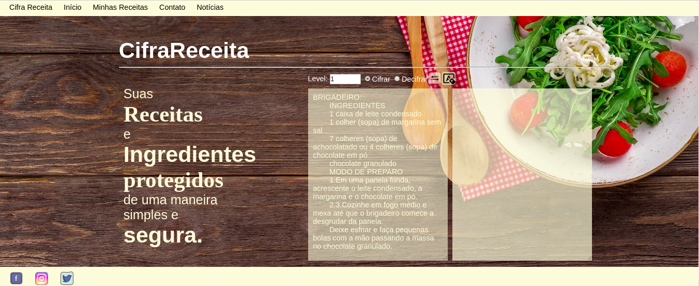
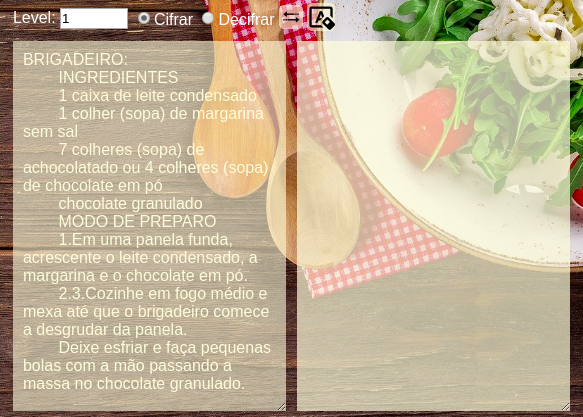
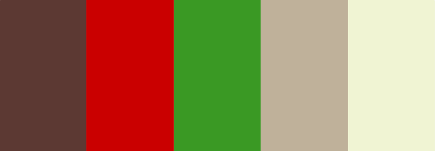

# CrifraReceita

## Índice
* [1. Introdução](#1-Introdução)
* [2. Definição do produto](#2-Definição-do-produto)
* [3. Principais usuários](#3-Principais-usuários)
* [4. Objetivo](#4-Objetivo)
* [5. Solução](#5-Solução)
* [6. Estrutura](#6-Estrutura)
* [7. Funcionamento](#7-Funcionamento)
* [8. Ferramentas](#8-Ferramentas)
* [9. Trabalhos futuros](#9-Trabalhos-futuros)

## 1. Introdução
O ramo da gastronomia requer sigilo em receitas e ingredientes. A fim de auxiliar tanto, profissionais da área, como os aspirantes a Chefe que não desejam compartilhar o elemento surpresa dos seus procedimentos, foi desenvolvido um site de cifrar receitas para que possam ser guardadas de forma segura.

## 2. Definição do produto
O produto é um site que possui ferramentas que auxiliam o usuário a cifrar e decifrar receitas.

## 3. Principais usuários
- Empresas do ramo alimentício
- Chefes de cozinha
- Pessoas comuns que desejam guardar suas receitas

## 4. Objetivo
O objetivo principal do produto é cifrar receitas, fórmulas e ingredientes gastronômicos.

## 5. Solução
Com suas receitas cifradas, o usuário pode ter mais segurança no armazenamento e envio para pessoas autorizadas(que podem usar o site para decifrar), sem que seus segredos sejam revelados e seus procedimentos sejam copiados.

## 6. Estrutura
O site tem uma estrutura clara e objetiva. 

### Boas-vindas
O site possui uma tela de boas-vindas, onde apresenta um resumo de sua funcionalidade.

### Estrutura principal
Após uma tela de boas-vindas, o usuário encontra duas caixas de texto, uma onde o usuário digita a receita e outra com o resultado.
Acima das caixas de texto existe um menu de configuração, onde ele escolhe o deslocamento desejado, as opções: cifrar ou decifrar, um botão para inverter o texto das caixas e um botão de limpar.

### Menu
Na parte superior da tela existe um menu com as opções:
- CifraReceita: Contém informações o site;
- Início: Direciona para boas-vindas;
- Minhas Receitas: Para futura implementação de armazenamento de receitas;
- Contato: Possuí informações de contato;
- Notícias: Para futura implementação de notícias sobre gastronomia;

Na parte inferior da tela possuí um menu com botões para direcionar para as redes sociais:
- Facebook;
- Instagram;
- Twitter;

### Cores
A paleta de cores escolhida para o produto remete a gastronomia, onde o marrom traz o aspecto de rústico, o vermelho e o verde trazem a lembrança de legumes e vegetais.

## 7. Funcionamento
A mensagem é cifrada ou decifrada conforme o usuário digita a mensagem, não sendo necessário um botão para iniciar a operação, o que facilita a dinâmica.
O menu superior das caixas possuí ferramentas a fim de facilitar a interação do usuário.
As lógicas de cifrar e decifrar se resume no deslocamento das letras do texto(que pode ser positivo ou negativo) definido pelo usuário.
Os caracteres diferentes de letras não serão modificados, eles serão mantidos na mesma ordem que forem digitados.

## 8. Ferramentas
Para a construção do site foi utilizado o software Visual Studio Code com a extenção do Node-js. Sua marcação foi feita em HTML e sua estilização em CSS. o CifraReceita foi programado em vanilla JavaScript, contendo dois arquivos, o index.js, responsável pela interação dos elementos do DOM e o chiper.js responsável pelas lógicas de cifrar e decifrar.

## 9. Trabalhos futuros
Futuramente, pode ser implementado um menu onde o usuário pode guardar e compartilhar suas receitas por categorias.

